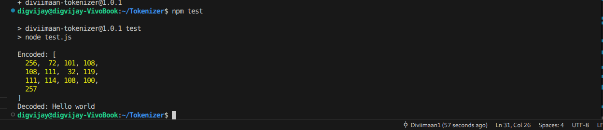

# Tokenizer

A custom JavaScript tokenizer that can **learn vocabulary from text**, **encode text into tokens**, and **decode tokens back to text**, with support for **special tokens**.

## ✨ Features
- Learns vocabulary from training text
- Encode plain text into token IDs
- Decode token IDs back into readable text
- Supports special tokens (`<BOS>`, `<EOS>`)
- Works as a package in Node.js
 
 
